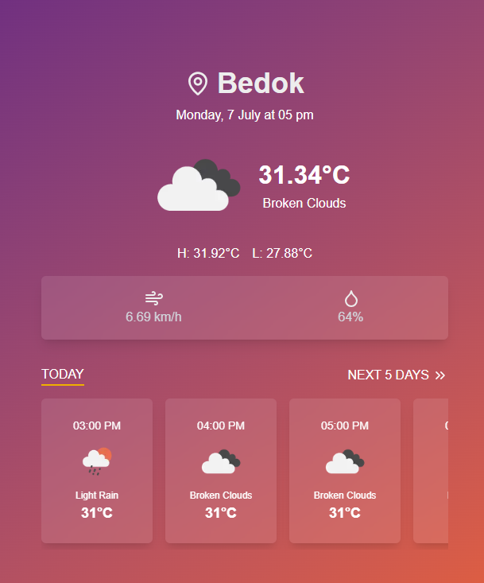

# weather-forecast-mini-app

A modern, component-driven weather forecast app for Singapore, built with Next.js, Zustand, and Storybook.



---

## Features

- 🌤️ **Current, Hourly, and Daily Weather**: View up-to-date weather for selected cities in Singapore.
- 🏙️ **City Management**: Add, remove, and pin cities to your main view.
- 🔄 **Auto-Refresh**: Weather data is automatically refreshed at a user-configurable interval (default: every 15 minutes).
- 💾 **Persistent State**: All settings and city lists are saved in your browser (localStorage).
- ⚙️ **Settings Page**: Customize forecast days and the weather data refetch interval.
- 🧩 **Component-Driven**: Built with reusable, documented UI components.
- 📚 **Storybook Integration**: Browse and test all UI components in isolation.
- 🧪 **End-to-End Testing**: Automated Playwright tests for main user flows.

---

## Getting Started

### 1. Clone the repository

```bash
git clone https://github.com/your-username/weather-forecast-mini-app.git
cd weather-forecast-mini-app
```

### 2. Install dependencies

```bash
npm install
# or
yarn install
```

### 3. Set up environment variables

Create a `.env.local` file in the root with your OpenWeather API keys:

```
OPENWEATHER_API_KEY=your_api_key
OPENWEATHER_API_CITY_URL=https://api.openweathermap.org/geo/1.0/direct
OPENWEATHER_API_ONE_CALL_URL=https://api.openweathermap.org/data/2.5/onecall
```

### 4. Run the development server

```bash
npm run dev
# or
yarn dev
```

Open [http://localhost:3000](http://localhost:3000) to view the app.

---

## Storybook

Browse and test all UI components in isolation:

```bash
npm run storybook
# or
yarn storybook
```

Open [http://localhost:6006](http://localhost:6006) in your browser.

---

## Playwright End-to-End Testing

This project uses [Playwright](https://playwright.dev/) for automated end-to-end tests.

### Setup

If you haven't already, install Playwright browsers:

```bash
npx playwright install
```

### Running Tests

Start your dev server (`npm run dev`), then in another terminal:

```bash
npx playwright test
```

- Test files are located in the `tests/` directory (see `tests/app.spec.ts`).
- You can view test results in the terminal or run `npx playwright show-report` for a visual report.

---

## Scripts

- `dev` – Start the Next.js development server
- `build` – Build the app for production
- `start` – Start the production server
- `lint` – Run ESLint
- `storybook` – Start Storybook for UI development
- `build-storybook` – Build the static Storybook site
- `test` – Run Playwright end-to-end tests

---

## Tech Stack

- **Next.js** – React framework for production
- **Zustand** – State management with persistence
- **Tailwind CSS** – Utility-first CSS framework
- **Storybook** – Component explorer and documentation
- **TypeScript** – Type safety
- **Playwright** – End-to-end testing
- **ESLint** – Linting and code quality

---

## Contributing

1. Fork the repo
2. Create your feature branch (`git checkout -b feature/your-feature`)
3. Commit your changes (`git commit -am 'Add new feature'`)
4. Push to the branch (`git push origin feature/your-feature`)
5. Open a pull request

---

## License

MIT